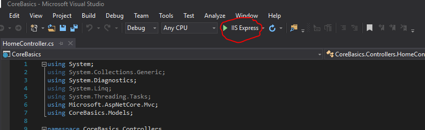

# ASP.NET Core Introduction

__Skill Level:__ Beginner  
__Time Limit:__ 10 minutes

This is an introductory challenge to get you acquainted with the ASP.NET Core MVC (Model View Controller) web application design pattern in Visual Studio.  Using the template provided, you will simply implement the functionality needed to navigate the user from the Controller to the View.

## Instructions
To open the project, open the project's .sln file in Visual Studio (must be installed).
The project is located at "./CoreIntroduction/CoreIntroduction.sln".

The application should navigate without error between the following Views  
1. _Index_  
2. _About_  
3. _Contact_  
4. _Privacy_   

__NOTE:__ Don't overthink this challenge.  We simply need to address any NotImplementedExceptions with the proper code to navigate to a the View.

__NOTE:__ Starting your web application running is really simple with the built in IIS Server.  All you need to do is click the button on the toolbar indicated below:

## Things to think about

- How do the View names compare to the current URL?
- Further, what is the frameworks's default View?
- What is the framework doing for us? (Hint: a lot!)
- What is the purpose of the controller?
- What component of the MVC pattern is missing from this challenge?

## Resources
- [Download MS Visual Studio IDE Community 2017](https://visualstudio.microsoft.com)
- [MSDocs: Add a View](https://docs.microsoft.com/en-us/aspnet/core/tutorials/first-mvc-app/adding-view?view=aspnetcore-2.2&tabs=visual-studio)

